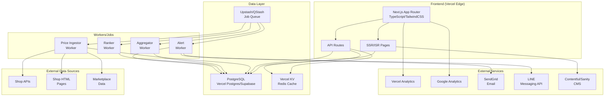
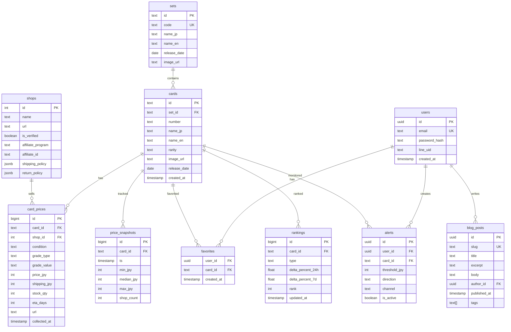
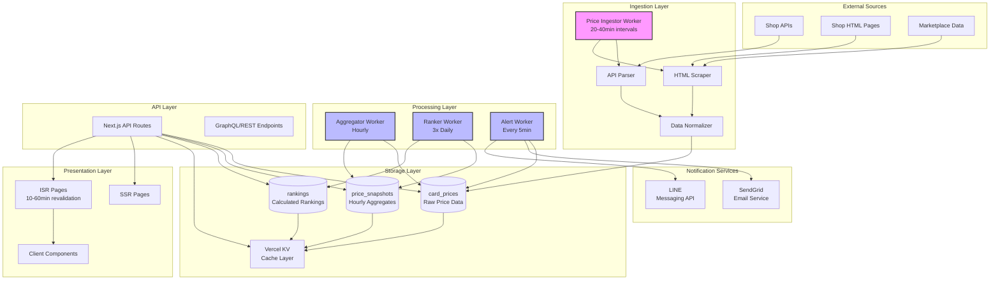
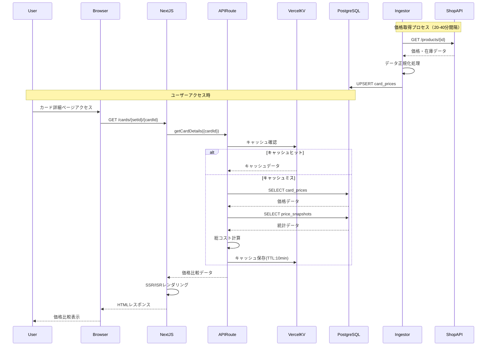
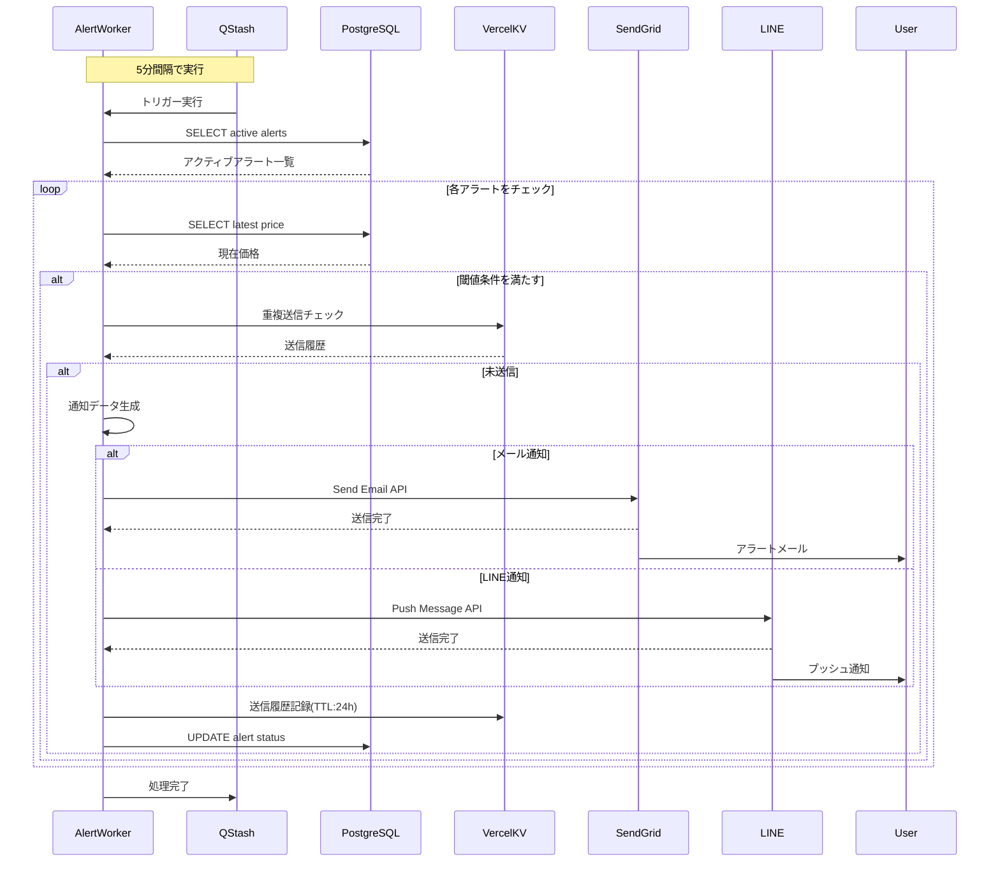
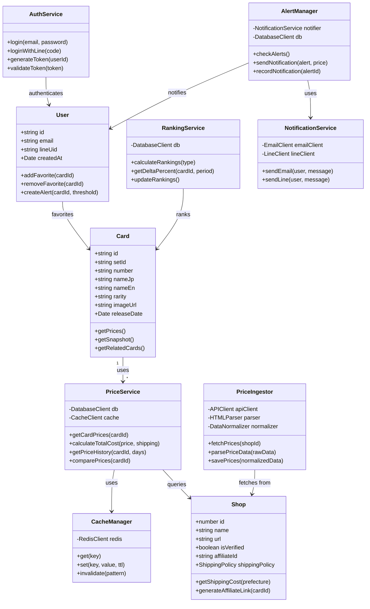
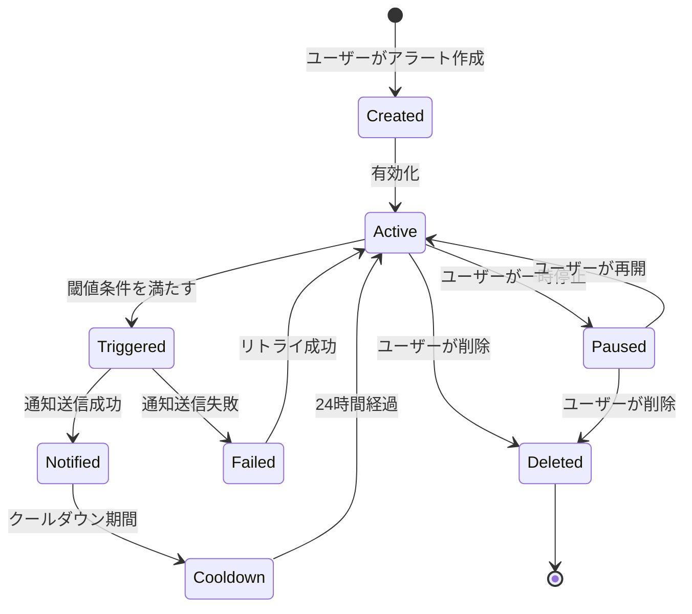
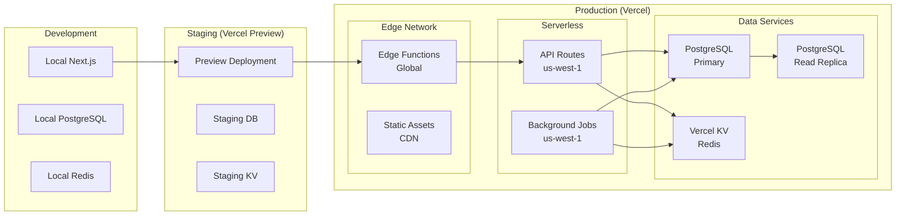

# ポケカサーチ 詳細設計書

作成日: 2025-08-10

## 1. システムアーキテクチャ図



## 2. ER図



## 3. データフロー図



## 4. シーケンス図（価格取得〜表示）



## 5. シーケンス図（アラート通知）



## 6. クラス図（主要コンポーネント）



## 7. コンポーネント構成図

```mermaid
graph TB
    subgraph "Pages (App Router)"
        P1[app/page.tsx<br/>ホームページ]
        P2[app/cards/[setId]/[cardId]/page.tsx<br/>カード詳細]
        P3[app/search/page.tsx<br/>検索結果]
        P4[app/rankings/[type]/page.tsx<br/>ランキング]
        P5[app/sets/[setId]/page.tsx<br/>新弾LP]
        P6[app/blog/page.tsx<br/>ブログ一覧]
        P7[app/mypage/page.tsx<br/>マイページ]
    end
    
    subgraph "UI Components"
        C1[PriceTable<br/>価格比較テーブル]
        C2[PriceBadge<br/>総コスト表示]
        C3[ShopTrustBadge<br/>信頼マーク]
        C4[PriceChart<br/>価格推移グラフ]
        C5[CardTile<br/>カードタイル]
        C6[SearchBar<br/>検索バー]
        C7[FilterPanel<br/>フィルタパネル]
        C8[FavoriteButton<br/>お気に入りボタン]
        C9[AlertModal<br/>アラート設定]
    end
    
    subgraph "API Routes"
        A1[api/cards/route.ts<br/>カード検索API]
        A2[api/cards/[id]/route.ts<br/>カード詳細API]
        A3[api/rankings/route.ts<br/>ランキングAPI]
        A4[api/favorites/route.ts<br/>お気に入りAPI]
        A5[api/alerts/route.ts<br/>アラートAPI]
        A6[api/auth/route.ts<br/>認証API]
    end
    
    P1 --> C5
    P1 --> C6
    P2 --> C1
    P2 --> C2
    P2 --> C3
    P2 --> C4
    P2 --> C8
    P2 --> C9
    P3 --> C5
    P3 --> C7
    P4 --> C5
    
    P1 --> A3
    P2 --> A2
    P3 --> A1
    P7 --> A4
    P7 --> A5
```

## 8. 状態遷移図（アラート）



## 9. デプロイメントアーキテクチャ

